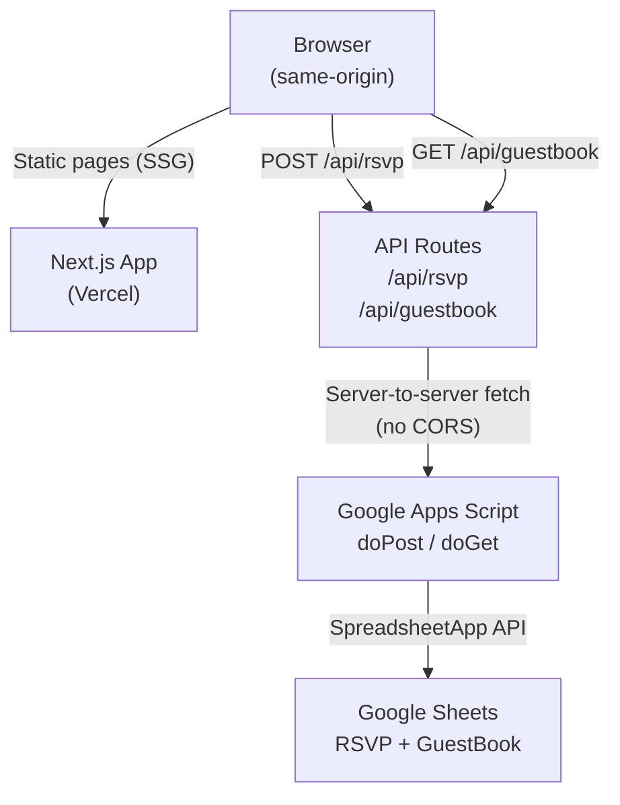
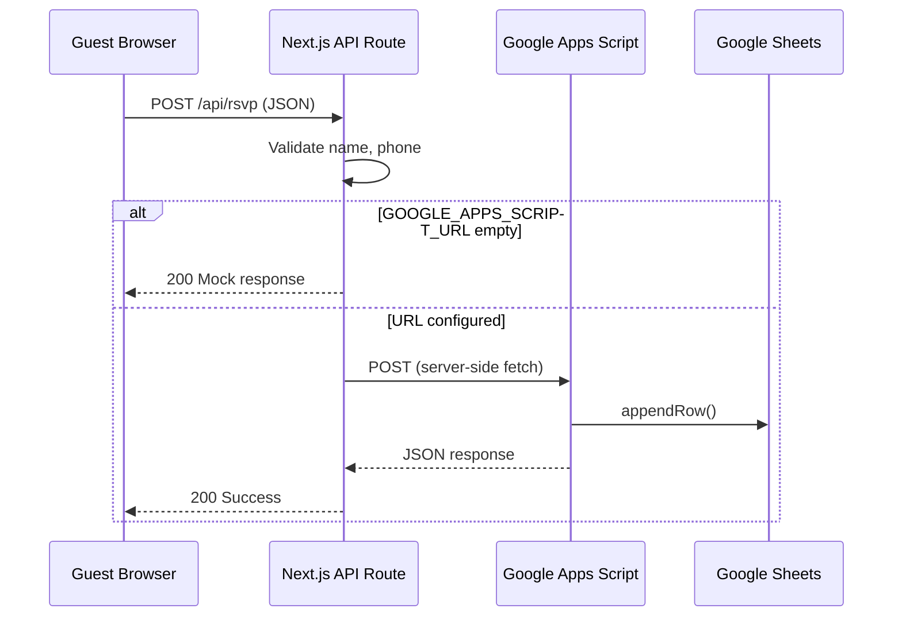
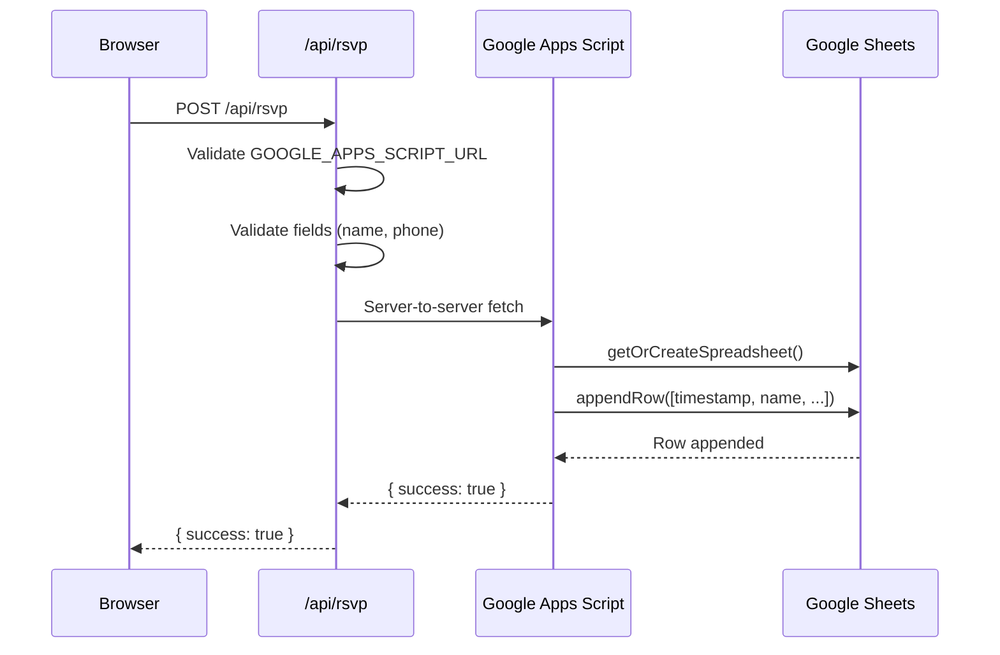

# Project Setup Guide — Wedding Invitation Platform

## Table of Contents

- [Project Overview](#project-overview)
- [Architecture](#architecture)
- [Folder Structure](#folder-structure)
- [Prerequisites](#prerequisites)
- [Installation](#installation)
- [Environment Variables](#environment-variables)
- [Google Apps Script Setup](#google-apps-script-setup)
- [Google Sheets Structure](#google-sheets-structure)
- [Vercel Deployment](#vercel-deployment)
- [API Flow](#api-flow)
- [API Endpoints](#api-endpoints)
- [Frontend Flow](#frontend-flow)
- [Troubleshooting](#troubleshooting)
- [Testing](#testing)
- [Security](#security)
- [Future Improvements](#future-improvements)
- [Lessons Learned](#lessons-learned)
- [Maintenance Guide](#maintenance-guide)
- [Changelog](#changelog)

---

## Project Overview

A production-quality digital wedding invitation website built with Next.js, TypeScript, Tailwind CSS, and Google Apps Script. Replaces printed invitations with a personalized, interactive web experience.

### Features

| Feature | Description |
|---|---|
| **Personalized invitation** | Guest name read from URL (`?to=GuestName`) |
| **Real-time countdown** | Days/hours/minutes/seconds to the wedding date |
| **Event information** | Ceremony and reception with Google Maps links |
| **Love story timeline** | Animated journey from first meet to wedding |
| **Photo gallery** | Responsive grid with full-screen lightbox |
| **RSVP system** | Form → Next.js API → Google Apps Script → Google Sheets |
| **Guest book** | Messages stored and displayed from Google Sheets |
| **Gift section** | Bank transfer with copy button, QRIS support |
| **Mock mode** | Full UI testing without any backend deployed |

### Technologies Used

| Layer | Technology |
|---|---|
| Framework | Next.js 16 (App Router) |
| Language | TypeScript (strict mode) |
| Styling | Tailwind CSS 4 |
| Animation | Framer Motion 12 |
| Icons | Lucide React |
| Backend | Next.js API Routes |
| External Service | Google Apps Script Web App |
| Database | Google Sheets |
| Hosting | Vercel (free tier) |
| Fonts | Playfair Display + Inter (via `next/font`) |

---

## Architecture



### Why this architecture?

The browser never calls Google Apps Script directly. All requests go through Next.js API routes on the **same origin**, which eliminates CORS entirely. The `GOOGLE_APPS_SCRIPT_URL` is a server-side environment variable — never exposed to the browser.

### Request Flow



---

## Folder Structure

```
wedProject/
├── public/                          # Static assets served at root
│   ├── hero-bg.svg                  # Hero section background
│   ├── og-image.svg                 # Open Graph preview image
│   ├── qris.svg                     # QRIS payment code
│   └── gallery/                     # Wedding photo gallery
│       ├── 1.svg - 6.svg            # Placeholder images
├── scripts/
│   └── Code.gs                      # Google Apps Script (standalone)
├── src/
│   ├── app/
│   │   ├── layout.tsx               # Root layout + metadata + fonts
│   │   ├── page.tsx                 # Main page (composes all sections)
│   │   ├── globals.css              # Tailwind imports + theme
│   │   └── api/
│   │       ├── rsvp/route.ts        # POST /api/rsvp
│   │       └── guestbook/route.ts   # GET+POST /api/guestbook
│   ├── components/
│   │   ├── layout/
│   │   │   ├── Navbar.tsx           # Floating nav, transparent→solid
│   │   │   └── Footer.tsx           # Thank-you footer
│   │   └── sections/
│   │       ├── HeroSection.tsx      # Landing page + countdown
│   │       ├── InvitationSection.tsx # Personalized greeting
│   │       ├── EventSection.tsx     # Ceremony & reception cards
│   │       ├── LoveStorySection.tsx # Animated timeline
│   │       ├── GallerySection.tsx   # Grid + lightbox
│   │       ├── RSVPSection.tsx      # RSVP form
│   │       ├── GuestBookSection.tsx # Messages + submit form
│   │       └── GiftSection.tsx      # Bank accounts + QRIS
│   ├── hooks/
│   │   ├── useCountdown.ts          # Real-time countdown (hydration-safe)
│   │   └── useGuestName.ts          # URL parameter parser
│   ├── lib/
│   │   └── utils.ts                 # cn(), formatDate(), countdown calc
│   ├── services/
│   │   └── sheets.ts                # API client for /api/rsvp & /api/guestbook
│   ├── constants/
│   │   └── wedding.ts               # All wedding data (names, dates, story)
│   └── types/
│       └── index.ts                 # TypeScript interfaces
├── docs/                            # Project documentation
├── .env.local                       # Local environment variables (gitignored)
├── .env.example                     # Template for env vars
├── next.config.ts                   # Next.js configuration
├── package.json
└── tsconfig.json
```

---

## Prerequisites

| Software | Version | Why Needed |
|---|---|---|
| Node.js | ≥ 18 | Runtime for Next.js |
| npm | ≥ 9 | Package manager (comes with Node) |
| Git | Any | Clone repository, version control |
| Google Account | Any | Google Apps Script + Google Sheets |
| Vercel Account | Free tier | Production hosting |
| Web browser | Any modern | Google Apps Script editor |

---

## Installation

```bash
# 1. Clone the repository
git clone https://github.com/ymanuel21/wedProject.git
cd wedProject

# 2. Install dependencies
npm install

# 3. Copy environment template
cp .env.example .env.local

# 4. Start development server
npm run dev
```

Open **http://localhost:3000** — the site loads in mock mode. RSVP and guest book work without any backend.

### Add guest personalization

```
http://localhost:3000?to=Yusack
http://localhost:3000?to=Dewi
http://localhost:3000                         ← shows "Para Tamu Undangan"
```

---

## Environment Variables

| Variable | Required | Public? | Description |
|---|---|---|---|
| `GOOGLE_APPS_SCRIPT_URL` | No (mock mode if empty) | **No** — server-side only | Google Apps Script Web App deployment URL |

### Why server-side only?

The variable is named `GOOGLE_APPS_SCRIPT_URL` — **not** `NEXT_PUBLIC_GOOGLE_APPS_SCRIPT_URL`. The `NEXT_PUBLIC_` prefix makes variables available in the browser, which would expose the GAS endpoint to anyone inspecting the page source. Keeping it server-side means the GAS URL is only accessible within Next.js API routes running on Vercel's infrastructure.

### Mock mode

When `GOOGLE_APPS_SCRIPT_URL` is empty or not set, the API routes return mock responses:

- **RSVP**: Returns `{ success: true }` after a simulated delay
- **GuestBook GET**: Returns two sample messages
- **GuestBook POST**: Returns `{ success: true }`

This allows full UI development and testing without deploying Google Apps Script.

---

## Google Apps Script Setup

### Step 1: Create the Script

1. Go to **[script.google.com](https://script.google.com)**
2. Click **New Project**
3. Delete all default code
4. Copy the entire contents of [`scripts/Code.gs`](../scripts/Code.gs) and paste
5. Click **Save** (Ctrl+S)
6. Rename the project to "Wedding RSVP" (click "Untitled project" at top-left)

### Step 2: First Request Triggers Sheet Creation

The script auto-creates the spreadsheet on the first request. You don't need to create it manually.

### Step 3: Deploy as Web App

1. Click **Deploy** → **New Deployment**
2. Click the gear ⚙️ next to "Select type" → **Web App**
3. Configure:
   - **Description**: `Wedding RSVP API`
   - **Execute as**: `Me`
   - **Who has access**: `Anyone`
4. Click **Deploy**
5. **Authorize** when prompted (the script needs permission to access Spreadsheets)
6. **Copy the deployment URL** — it looks like:
   ```
   https://script.google.com/macros/s/AKfycbxxxxx/exec
   ```

### Step 4: Verify

Open the URL in your browser with `?type=guestbook` appended:

```
https://script.google.com/macros/s/YOUR_ID/exec?type=guestbook
```

Expected response (first request):

```json
{"success": true, "messages": []}
```

A spreadsheet named "Wedding RSVP Data" is automatically created in your Google Drive.

### Common Mistakes

| Mistake | Symptom | Fix |
|---|---|---|
| Pasted old script with `addHeader()` | "TypeError: output.addHeader is not a function" | Use latest `Code.gs` from the repository |
| Didn't deploy as Web App | "Halaman Tidak Ditemukan" (404) | Click Deploy → New Deployment → Web App |
| Script edited but not re-deployed | "Moved Temporarily" | Manage Deployments → Edit → New Version |
| Didn't authorize | Permission error | Click "Review Permissions" during deployment |
| Used `getActiveSpreadsheet()` | "Cannot read properties of null" | Script now uses `getOrCreateSpreadsheet()` |

### Updating the Script

After editing the code:

1. Click **Deploy** → **Manage deployments**
2. Click the **pencil icon ✏️** on the active deployment
3. Change Version to **"New version"**
4. Click **Deploy**
5. The URL stays the same — no need to update Vercel

---

## Google Sheets Structure

The script auto-creates one spreadsheet named **"Wedding RSVP Data"** with two sheets:

### Sheet: "Wedding RSVP"

| Column | Type | Description |
|---|---|---|
| Timestamp | DateTime | ISO 8601 timestamp of submission |
| Name | Text | Guest full name |
| Phone | Text | Guest phone number |
| Attendance | Text | `hadir` / `tidak_hadir` / `ragu` |
| GuestCount | Number | Number of guests (1-5) |
| Message | Text | Optional message (max 500 chars) |

### Sheet: "Wedding GuestBook"

| Column | Type | Description |
|---|---|---|
| Timestamp | DateTime | ISO 8601 timestamp |
| Name | Text | Guest name |
| Message | Text | Congratulatory message |

---

## Vercel Deployment

### Step 1: Connect Repository

1. Go to **[vercel.com/import](https://vercel.com/import)**
2. Select the GitHub repository `ymanuel21/wedProject`
3. Vercel auto-detects Next.js — no configuration needed

### Step 2: Add Environment Variable

In the Vercel project dashboard → **Settings** → **Environment Variables**:

| Key | Value |
|---|---|
| `GOOGLE_APPS_SCRIPT_URL` | `https://script.google.com/macros/s/YOUR_ID/exec` |

**Do NOT** add `NEXT_PUBLIC_` prefix — the variable must remain server-side only.

### Step 3: Deploy

Click **Deploy**. Vercel builds the project and provides a URL:

```
https://wed-project.vercel.app
```

Every subsequent `git push` to `main` triggers an automatic redeployment.

### Preview Deployments

Every pull request gets its own preview URL (e.g., `https://wed-project-abc123.vercel.app`). Environment variables are inherited from production.

### Vercel Deployment Protection

If you see a Vercel login page when visiting the production URL, Vercel Deployment Protection is enabled. Disable it in **Settings → Deployment Protection → Disable**.

---

## API Flow



### Why no CORS?

| Connection | Origin | CORS needed? |
|---|---|---|
| Browser → Next.js API | Same origin (`/api/rsvp`) | No |
| Next.js → Google Apps Script | Server-to-server | No |

The browser only talks to the same origin. The Next.js server (on Vercel) makes the cross-origin call to Google — servers aren't subject to CORS restrictions.

---

## API Endpoints

### POST /api/rsvp

**Request:**

```json
{
  "name": "Yusack Manuel",
  "phone": "08123456789",
  "attendance": "hadir",
  "guestCount": 2,
  "message": "Selamat!"
}
```

**Success (200):**

```json
{
  "success": true,
  "message": "RSVP berhasil dikirim. Terima kasih!"
}
```

**Validation Error (400):**

```json
{
  "success": false,
  "stage": "validation",
  "error": "Nama dan nomor telepon wajib diisi.",
  "status": 400
}
```

**Configuration Error (500):**

```json
{
  "success": false,
  "stage": "configuration",
  "reason": "GOOGLE_APPS_SCRIPT_URL must start with https://",
  "valuePreview": "http://script.google.com...",
  "status": 500
}
```

**GAS Error (502):**

```json
{
  "success": false,
  "stage": "google-apps-script-error",
  "error": "<HTML error page content>",
  "status": 404
}
```

### GET /api/guestbook

**Response (200):**

```json
{
  "success": true,
  "messages": [
    {
      "timestamp": "2026-07-03T12:00:00.000Z",
      "name": "Budi & Ani",
      "message": "Selamat menempuh hidup baru!"
    }
  ]
}
```

### POST /api/guestbook

**Request:**

```json
{
  "name": "Yusack",
  "message": "Selamat ya!"
}
```

**Response (200):**

```json
{
  "success": true,
  "message": "Ucapan terkirim!"
}
```

---

## Frontend Flow

### RSVP Submission

```
1. User fills form (name, phone, attendance, guest count, message)
2. Client-side validation: name and phone required
3. Button changes to "Mengirim..." with spinner (Loader2 icon)
4. fetch("/api/rsvp", { method: "POST", body: JSON })
5. API validates → forwards to GAS → GAS writes to Sheets
6. Success: form replaced with "Terima Kasih!" checkmark
7. Error: red error message with AlertCircle icon
```

### Guest Book Loading

```
1. Component mounts → fetch("/api/guestbook", { method: "GET" })
2. API returns messages from GAS (or mock data)
3. Messages displayed in scrollable list
4. User submits new message → POST → success → "Terima kasih" screen
```

### Loading States

- **RSVP**: Button shows `Loader2` spinner + "Mengirim..."
- **Gallery images**: `next/image` lazy loading with blur placeholder
- **Guest personalization**: `Suspense` fallback around `InvitationSection`

---

## Troubleshooting

### CORS Error

**Symptoms:** Browser console shows "No 'Access-Control-Allow-Origin' header is present"

**Cause:** Frontend was making direct `fetch()` calls from the browser to `script.google.com` (cross-origin)

**Solution:** All requests now go through Next.js API routes on the same origin. Browser → `/api/rsvp` → server → GAS. No CORS needed.

### HTTP 502 — "stage": "google-apps-script-error"

**Symptoms:** API returns 502, GAS returns HTML error page instead of JSON

**Common causes:**

| Cause | GAS Error | Fix |
|---|---|---|
| Wrong deployment ID | "Halaman Tidak Ditemukan" (404) | Verify the deployment URL ends with `/exec` |
| Script not re-deployed after edit | "Moved Temporarily" | Manage Deployments → Edit → New Version |
| `getActiveSpreadsheet()` in standalone script | "Cannot read properties of null" | Use latest `Code.gs` (auto-creates spreadsheet) |
| `addHeader()` does not exist | "addHeader is not a function" | Latest `Code.gs` removes all `addHeader()` calls |

### HTTP 502 — "stage": "fetch-google-apps-script"

**Symptoms:** API returns 502 with "Failed to parse URL"

**Cause:** `GOOGLE_APPS_SCRIPT_URL` is invalid or has whitespace

**Solution:** Verify the URL in Vercel environment variables:
- Must start with `https://`
- Must point to `script.google.com`
- Must end with `/exec`
- Must not have trailing spaces or newlines

### HTTP 500 — "stage": "configuration"

**Symptoms:** API returns 500 with "GOOGLE_APPS_SCRIPT_URL must start with https://"

**Cause:** Environment variable set to a URL without `https://` protocol

**Solution:** Add `https://` prefix to the URL

### HTTP 500 — "stage": "unexpected-error"

**Symptoms:** API returns generic 500

**Cause:** Uncaught error in the API route (network timeout, DNS failure, etc.)

**Debugging:** Check Vercel Function Logs:
1. Vercel Dashboard → your project → Logs
2. Look for `[RSVP API]` or `[GuestBook API]` entries
3. Each request has a unique ID for tracing

### Google Apps Script 404

**Symptoms:** API returns 502, GAS response is "Halaman Tidak Ditemukan"

**Cause:** The deployment URL is wrong or the script was deleted

**Solution:** Go to script.google.com → your project → Deploy → Manage deployments → copy the correct URL ending with `/exec`

### Google Apps Script Permissions

**Symptoms:** GAS returns HTML error about permissions

**Cause:** Script hasn't been authorized to access Google Sheets

**Solution:** During deployment, click "Review Permissions" and authorize the script. If you already deployed, go to the script editor → Run → `doGet` → authorize when prompted.

### Vercel Environment Variables Not Loading

**Symptoms:** API always returns mock responses in production

**Cause:** `GOOGLE_APPS_SCRIPT_URL` not set, or set with wrong name

**Solution:** Verify in Vercel → Settings → Environment Variables:
- Name: `GOOGLE_APPS_SCRIPT_URL` (exact match, no `NEXT_PUBLIC_`)
- Value: full URL with `https://`
- Environment: Production (or All)

### Deployment Protection

**Symptoms:** Vercel login page appears before the wedding site

**Cause:** Vercel Deployment Protection is enabled

**Solution:** Settings → Deployment Protection → Disable

---

## Testing

### Local Verification Checklist

```
□ npm run dev starts without errors
□ http://localhost:3000 loads the hero section
□ Countdown ticks every second
□ ?to=GuestName shows personalized greeting
□ Nav links scroll to correct sections
□ Gallery opens lightbox, navigates with arrows
□ RSVP form shows error when name is empty
□ RSVP form shows mock success after submit
□ Guest book shows mock messages
□ Guest book submit shows success screen
□ Gift copy button copies account number
□ Mobile viewport (375px) shows hamburger menu
□ npm run build succeeds
□ npm run lint returns zero errors
```

### API Testing

```bash
# Test mock RSVP (no GAS URL set)
curl -X POST http://localhost:3000/api/rsvp \
  -H "Content-Type: application/json" \
  -d '{"name":"Test","phone":"0812","attendance":"hadir","guestCount":1}'

# Test mock GuestBook GET
curl http://localhost:3000/api/guestbook

# Test mock GuestBook POST
curl -X POST http://localhost:3000/api/guestbook \
  -H "Content-Type: application/json" \
  -d '{"name":"Test","message":"Selamat!"}'
```

### Production Verification

```
□ Visit Vercel production URL
□ RSVP form submits successfully
□ RSVP data appears in Google Sheets
□ Guest book loads messages from Sheets
□ Guest book submit adds new row to Sheets
□ All images load (hero, gallery, QRIS)
□ Mobile responsive
□ No console errors in DevTools
```

---

## Security

### GOOGLE_APPS_SCRIPT_URL is server-side only

The variable is named `GOOGLE_APPS_SCRIPT_URL` — without the `NEXT_PUBLIC_` prefix. In Next.js:

| Prefix | Availability |
|---|---|
| `NEXT_PUBLIC_*` | Browser + Server |
| Plain `*` | Server only |

The GAS deployment URL is never sent to the browser. View Source or DevTools will not reveal it.

### API Routes as a Proxy Layer

The Next.js API routes act as an intermediary:

1. **Input validation** — name, phone required before forwarding
2. **URL validation** — `new URL()` + hostname check before `fetch()`
3. **Error masking** — GAS errors are caught and returned as structured JSON, never raw HTML
4. **Logging** — every request gets a unique ID, errors are logged with stage tracking

### What's not protected (by design)

- **No authentication** — the RSVP form is intentionally open (it's a wedding invitation)
- **No rate limiting** — GAS has a 20,000 requests/day quota, sufficient for a wedding
- **No CAPTCHA** — could be added if spam becomes an issue

---

## Future Improvements

| Category | Improvement |
|---|---|
| **Auth** | Admin login to view RSVP data without opening Google Sheets |
| **Admin Dashboard** | `/admin` page showing RSVP stats, guest list, attendance count |
| **Rate Limiting** | `next-rate-limit` on API routes to prevent abuse |
| **Spam Protection** | reCAPTCHA or honeypot field on RSVP form |
| **Analytics** | Plausible.io (privacy-focused) for page views and RSVP conversion |
| **Monitoring** | Vercel Analytics or Sentry for error tracking |
| **Logging** | Structured logging to external service (Axiom, Logtail) |
| **CI/CD** | GitHub Actions for lint, type-check, and build on every PR |
| **Unit Tests** | Vitest + React Testing Library for hooks and utilities |
| **Integration Tests** | Playwright for full RSVP flow |
| **E2E Tests** | Playwright for the complete user journey |
| **Music** | Background music with play/pause toggle |
| **WhatsApp Share** | Share button that generates a personalized invitation link |
| **Multi-locale** | English/Indonesian language toggle |
| **Print Stylesheet** | `@media print` for physical copies |

---

## Lessons Learned

### Problems Encountered

| # | Problem | Root Cause | Solution |
|---|---|---|---|
| 1 | **CORS errors** | Browser calling GAS directly (cross-origin) | Next.js API routes as proxy |
| 2 | **Hydration mismatch** | `new Date()` in useState initializer | Static placeholder + useEffect |
| 3 | **GAS `addHeader` not a function** | `ContentService.TextOutput` has no `addHeader()` | Removed all header manipulation |
| 4 | **GAS `getActiveSpreadsheet` null** | Standalone scripts have no bound sheet | `getOrCreateSpreadsheet()` with auto-create |
| 5 | **GAS returns HTML 404** | Script edited but not re-deployed | "New version" deployment step |
| 6 | **HTTP 502 from bad URL** | `fetch()` called with invalid URL | `new URL()` validation before fetch |
| 7 | **ESLint `set-state-in-effect`** | React 19 stricter effect rules | Lazy initializer pattern, eslint-disable for legitimate time sync |

### Best Practices Established

1. **Server-side proxy for external APIs** — eliminates CORS and hides credentials
2. **Mock mode for local development** — full UI testing without backend
3. **Structured logging with request IDs** — every request traceable through the pipeline
4. **Environment validation at startup** — fail fast with clear error messages
5. **Auto-creation of resources** — spreadsheet created on first request, no manual setup
6. **Hydration-safe time components** — placeholder → useEffect → real values

### Things to Avoid

- ❌ `NEXT_PUBLIC_*` for secrets or service URLs
- ❌ Direct browser-to-GAS `fetch()` calls
- ❌ `getActiveSpreadsheet()` in standalone GAS scripts
- ❌ Setting CORS headers in GAS when proxied through Next.js
- ❌ `new Date()` in render or `useState` initializers
- ❌ Deploying GAS without the "New version" step

---

## Maintenance Guide

### Update Google Apps Script

1. Edit `scripts/Code.gs` in the repository
2. Test locally by calling the API endpoints
3. Push to GitHub
4. Copy the updated code from GitHub
5. Paste into script.google.com
6. Deploy → Manage deployments → Edit → New version → Deploy

### Redeploy Vercel

```bash
git push origin main
```

Vercel auto-deploys on every push to `main`. No manual steps needed.

### Rotate Environment Variables

If you need to change the GAS deployment:

1. Deploy a new GAS version
2. Copy the new URL
3. Update `GOOGLE_APPS_SCRIPT_URL` in Vercel Settings → Environment Variables
4. Redeploy from Vercel dashboard or `git push`

### Update Dependencies

```bash
npm outdated          # Check for updates
npm update            # Safe updates (patch/minor)
npm install next@latest  # Major updates (test thoroughly)
```

### Monitor Logs

- **Local:** Terminal output from `npm run dev`
- **Production:** Vercel Dashboard → Logs → filter by `[RSVP API]` or `[GuestBook API]`
- **Google Sheets:** Check the spreadsheet for new rows after test submissions

---

## Changelog

### v1.0.0 — Initial Release (2026-07-03)

**Added:**

- Landing page with hero section, animated names, real-time countdown
- Personalized invitation via `?to=` URL parameter
- Event information (ceremony & reception) with Google Maps links
- Love story animated timeline (4 milestones)
- Photo gallery with responsive grid and full-screen lightbox
- RSVP form with client-side validation
- Next.js API routes (`/api/rsvp`, `/api/guestbook`) as GAS proxy
- Google Apps Script for RSVP and guest book storage
- Auto-creating spreadsheet on first request
- Guest book with message display and submission
- Gift section with bank transfer, copy button, QRIS placeholder
- Mock mode for local development (no GAS required)
- Floating navigation bar (transparent → solid on scroll)
- Responsive design (mobile hamburger menu)
- Framer Motion animations throughout
- TypeScript strict mode
- Tailwind CSS 4 theming (rose gold palette, Playfair Display + Inter)
- Structured API logging with request IDs and stage tracking
- Environment variable validation (`new URL()` + hostname check)

**Fixed:**

- Hydration mismatch in countdown timer (static placeholder pattern)
- CORS errors (server-side proxy architecture)
- Google Apps Script `addHeader()` error (removed, handled by Next.js)
- Google Apps Script `getActiveSpreadsheet()` null (auto-create)
- ESLint `set-state-in-effect` violations
- Footer `new Date()` hydration risk (lazy initializer)

**Known Limitations:**

- No authentication (intentionally open for wedding guests)
- No rate limiting (GAS quota of 20,000 requests/day)
- Gallery uses SVG placeholders (replace with real photos)
- QRIS uses SVG placeholder (replace with actual QR code)
- Background music file not included (`public/music/wedding.mp3`)
